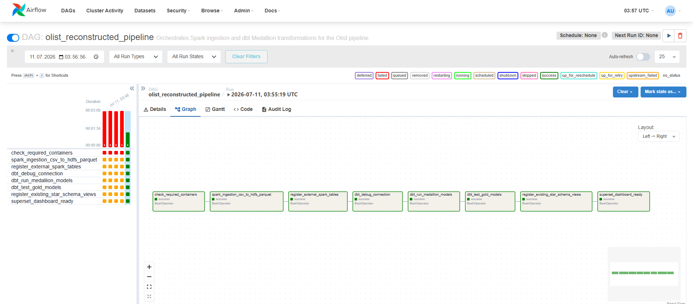
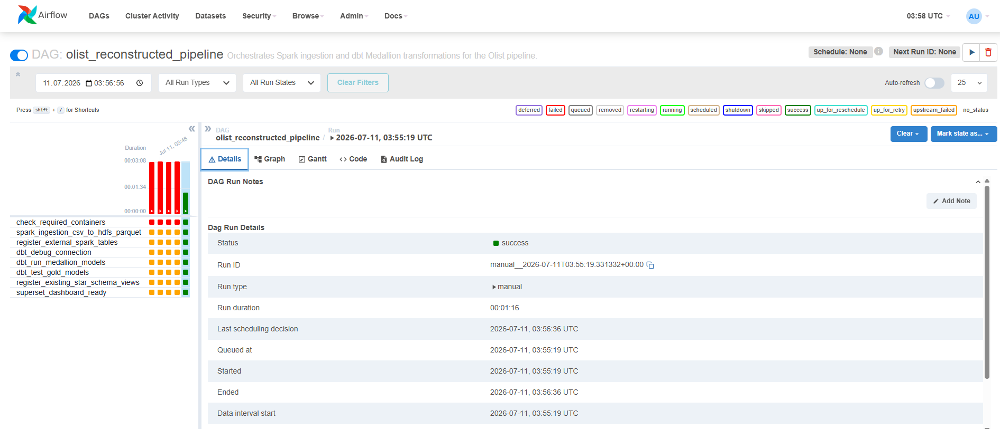
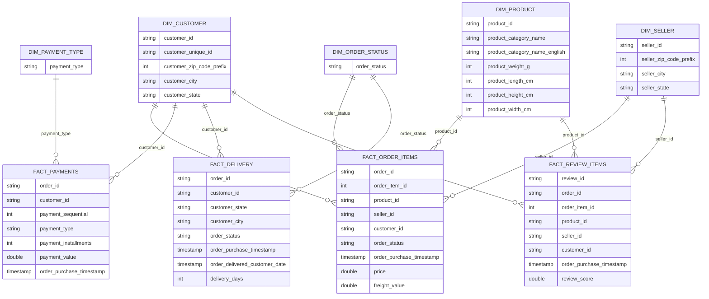

# 🛒 Olist Big Data Analytics Pipeline

Bu proje, **Olist Brazilian E-Commerce** veri seti kullanılarak geliştirilmiş uçtan uca bir **Big Data Analytics Pipeline** çalışmasıdır.

Proje başlangıçta Spark, HDFS ve Superset kullanılarak kurulmuş; sonrasında Apache Airflow ve dbt eklenerek yeniden yapılandırılmıştır.

Güncel pipeline; ham CSV verisini Spark ile işler, HDFS üzerinde Parquet olarak saklar, dbt ile Bronze / Silver / Gold katmanlarına ayırır, Gold katmanda star schema mantığında fact ve dimension modelleri oluşturur ve sonuçları Apache Superset dashboard'u ile görselleştirir.

---

## 📌 Güncel Pipeline Akışı

```text
Raw Olist CSV Files
        ↓
Apache Spark Ingestion
        ↓
HDFS Parquet Storage
        ↓
Spark SQL External Tables
        ↓
dbt Bronze Models
        ↓
dbt Silver Models
        ↓
dbt Gold Star Schema Models
        ↓
Apache Superset Dashboard
```

---

## 📊 Dashboard Ön İzleme

### Olist Dashboard


### Airflow DAG Success





---

## 🧰 Kullanılan Teknolojiler

- Docker & Docker Compose
- Apache Spark
- HDFS
- Spark SQL
- Spark ThriftServer
- Apache Superset
- Apache Airflow
- dbt
- Python
- SQL
- Parquet
- Git & GitHub

---

## 📁 Veri Seti

Projede **Olist Brazilian E-Commerce Public Dataset** kullanılmıştır.

Kullanılan CSV dosyaları:

- `olist_customers_dataset.csv`
- `olist_geolocation_dataset.csv`
- `olist_order_items_dataset.csv`
- `olist_order_payments_dataset.csv`
- `olist_order_reviews_dataset.csv`
- `olist_orders_dataset.csv`
- `olist_products_dataset.csv`
- `olist_sellers_dataset.csv`
- `product_category_name_translation.csv`

Ham veri dosyaları şu klasöre yerleştirilmelidir:

```text
data/raw/
```

> Ham CSV dosyaları büyük olduğu için GitHub repository içerisine eklenmemiştir.

---

## 🏗️ Medallion Architecture

Projede dbt ile **Bronze / Silver / Gold** katmanlı Medallion Architecture uygulanmıştır.

### Bronze Layer

Bronze katmanı, Spark SQL üzerinde kayıtlı ham kaynak tablolarını temsil eder.

Konum:

```text
dbt_olist/models/bronze/
```

Bu katman ham veri yapısını korur ve downstream dönüşümler için sabit kaynak görevi görür.

### Silver Layer

Silver katmanı temizlenmiş ve standartlaştırılmış veriyi temsil eder.

Konum:

```text
dbt_olist/models/silver/
```

Bu katmanda:

- tarih kolonları timestamp formatına dönüştürülür,
- sayısal kolonlar uygun tiplere cast edilir,
- eksik anahtarlar filtrelenir,
- şehir ve eyalet alanları standartlaştırılır,
- kategori çeviri tablosu analize uygun hale getirilir.

### Gold Layer

Gold katmanı iş zekası ve dashboard için hazırlanmış analitik modelleri içerir.

Konum:

```text
dbt_olist/models/gold/
```

Bu katmanda star schema mantığında fact ve dimension modelleri oluşturulur.

---

## ⭐ Star Schema Veri Modeli

### Dimension Models

- `dim_customer`
- `dim_seller`
- `dim_product`
- `dim_order_status`
- `dim_payment_type`
- `dim_geolocation`

### Fact Models

- `fact_order_items`
- `fact_payments`
- `fact_delivery`
- `fact_review_items`



---

## 🔁 Airflow Orchestration

Pipeline, Apache Airflow ile orkestre edilmiştir.

DAG dosyası:

```text
orchestration/dags/olist_reconstructed_pipeline.py
```

DAG adı:

```text
olist_reconstructed_pipeline
```

Airflow DAG sırasıyla şu işleri çalıştırır:

1. Gerekli container'ları kontrol eder.
2. Spark ingestion job'ını çalıştırır.
3. HDFS Parquet çıktılarından Spark SQL external tablolarını oluşturur.
4. dbt bağlantısını test eder.
5. dbt Bronze / Silver / Gold modellerini çalıştırır.
6. dbt testlerini çalıştırır.
7. Mevcut Spark SQL star schema view'larını yeniler.
8. Superset dashboard katmanının hazır olduğunu bildirir.

Airflow arayüzü:

```text
http://localhost:8089
```

Giriş bilgileri:

```text
admin / admin
```

---

## 🚀 Projeyi Çalıştırma

### 1. Docker Network Oluşturma

```powershell
.\scripts\setup_network.ps1
```

Alternatif:

```powershell
docker network create bigdata-net
```

### 2. Temel Servisleri Başlatma

```powershell
docker compose -f docker/docker-compose-hdfs.yml up -d
docker compose -f docker/docker-compose-spark.yml up -d
docker compose -f docker/docker-compose-superset.yml up -d
```

### 3. dbt Servisini Başlatma

```powershell
docker compose -f docker/docker-compose-dbt.yml up -d --build
```

### 4. Airflow Servisini Başlatma

```powershell
docker compose -f docker/docker-compose-airflow.yml up -d --build
```

### 5. dbt Kontrol Komutları

```powershell
docker exec -it olist-dbt dbt debug --project-dir /app/dbt_olist --profiles-dir /app/dbt_olist
docker exec -it olist-dbt dbt run --project-dir /app/dbt_olist --profiles-dir /app/dbt_olist
docker exec -it olist-dbt dbt test --project-dir /app/dbt_olist --profiles-dir /app/dbt_olist
```

---

## 📊 Superset Dashboard

Superset adresi:

```text
http://localhost:8088
```

Giriş bilgileri:

```text
admin / admin
```

Superset, Spark ThriftServer'a şu URI ile bağlanmıştır:

```text
hive://hive@spark-thriftserver:10000/olist
```

Dashboard adı:

```text
Olist Dashboard
```

Oluşturulan bazı grafikler:

- Revenue by Payment Type
- Orders by Status
- Monthly Orders
- Payment Method Trends
- Monthly Revenue by Top Product Categories
- Monthly Orders by Customer State
- Monthly Revenue by Customer State
- Order Status Trends
- Monthly Average Delivery Time by State
- Monthly Average Review Score by Category
- Revenue by Product Category
- Sales by Customer State
- Top Performing Sellers

---

## 📈 Cevaplanabilen Business Soruları

| Business Question | Kullanılan Model |
|---|---|
| Monthly revenue | `fact_payments` |
| Revenue by product category | `fact_order_items` + `dim_product` |
| Top-performing sellers | `fact_order_items` + `dim_seller` |
| Sales by customer state | `fact_payments` + `dim_customer` |
| Average delivery time by state | `fact_delivery` + `dim_customer` |
| Payment method trends | `fact_payments` + `dim_payment_type` |
| Average review score by category | `fact_review_items` + `dim_product` |

---

## 📂 Proje Klasör Yapısı

```text
BigData-Pipeline-Project/
├── dbt_olist/
│   ├── dbt_project.yml
│   ├── profiles.yml
│   └── models/
│       ├── bronze/
│       ├── silver/
│       └── gold/
│
├── docker/
│   ├── Dockerfile.airflow
│   ├── Dockerfile.dbt
│   ├── docker-compose-airflow.yml
│   ├── docker-compose-dbt.yml
│   ├── docker-compose-hdfs.yml
│   ├── docker-compose-spark.yml
│   └── docker-compose-superset.yml
│
├── orchestration/
│   └── dags/
│       └── olist_reconstructed_pipeline.py
│
├── processing/
│   ├── csv_to_parquet.py
│   ├── create_spark_tables.sql
│   └── create_star_schema_views.sql
│
├── docs/
│   └── phase3_architecture.md
│
├── reports/
│   └── REPORT.md
│
├── visualization/
│   ├── register_tables.py
│   └── screenshots/
│
└── README.md
```

---

## 📄 Detaylı Rapor

Detaylı rapor için:

```text
reports/REPORT.md
```

Phase 3 mimari dokümanı için:

```text
docs/phase3_architecture.md
```

---

## ✅ Sonuç

Bu proje, ham Olist CSV verilerini uçtan uca işleyen bir Big Data Analytics Pipeline olarak yeniden yapılandırılmıştır.

Spark ingestion, HDFS Parquet storage, dbt Medallion Architecture, Airflow orchestration ve Superset dashboard bileşenleri birlikte çalışacak şekilde entegre edilmiştir.
