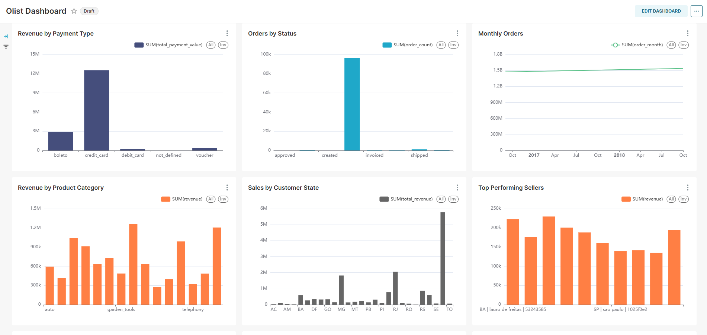
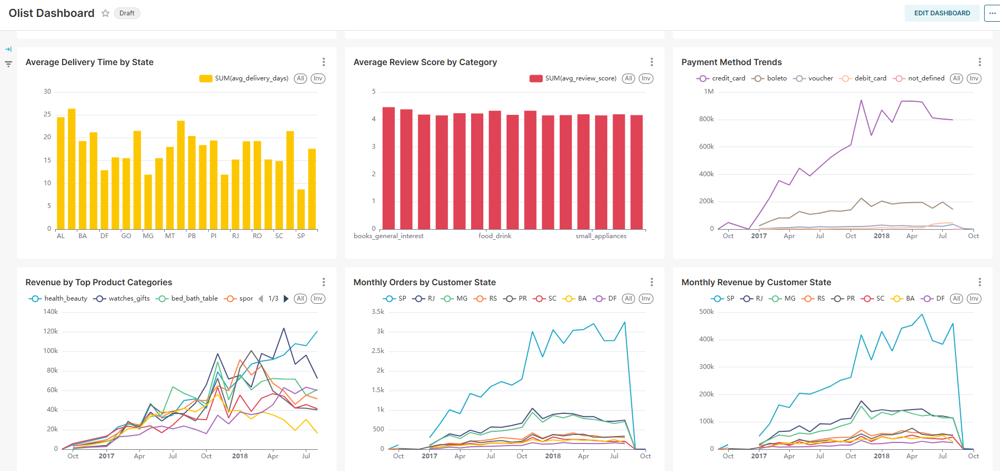
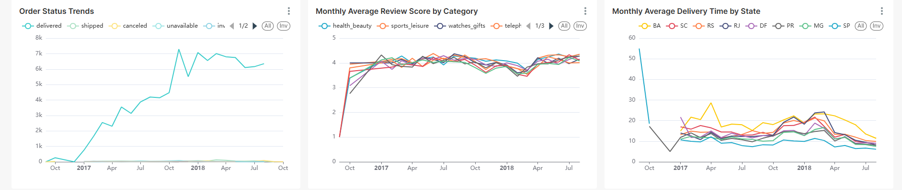
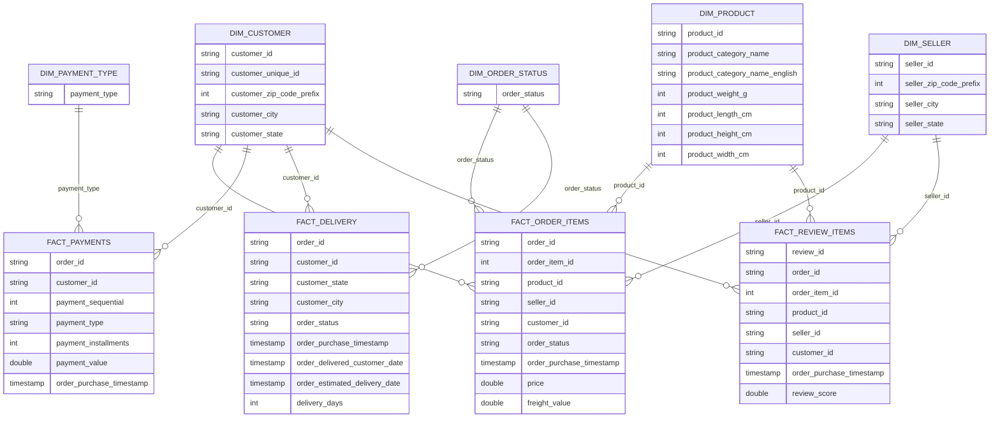
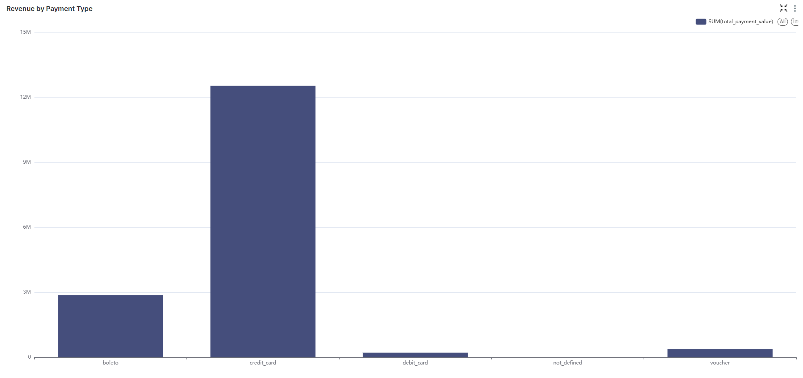
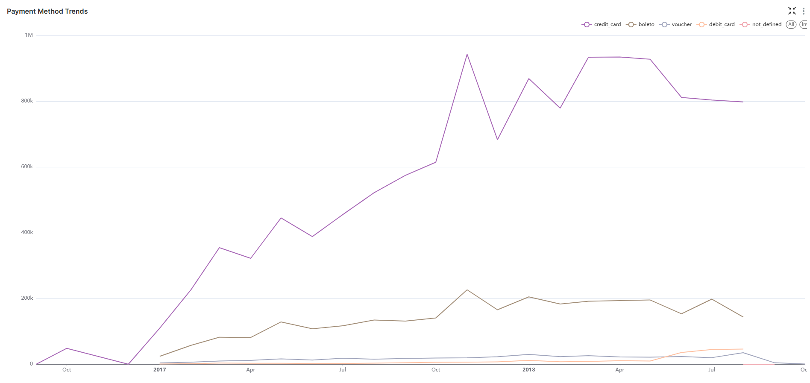
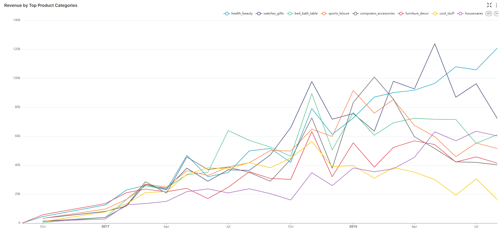
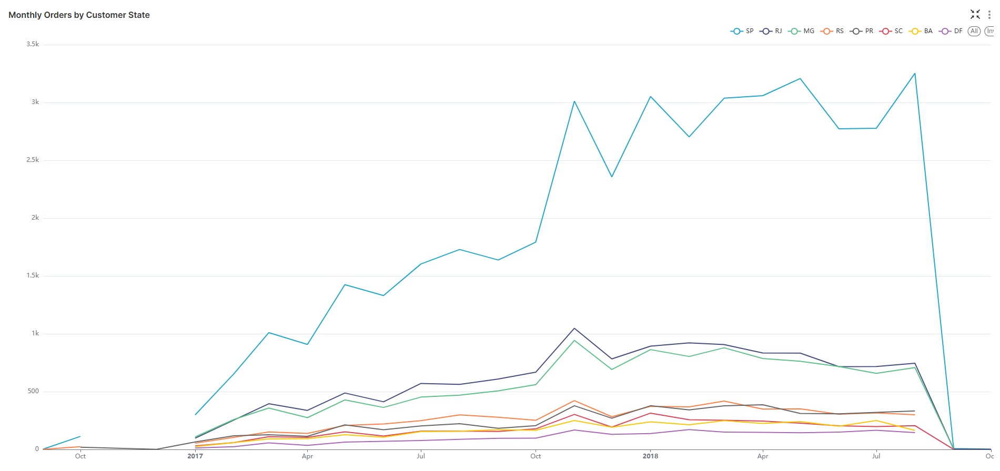
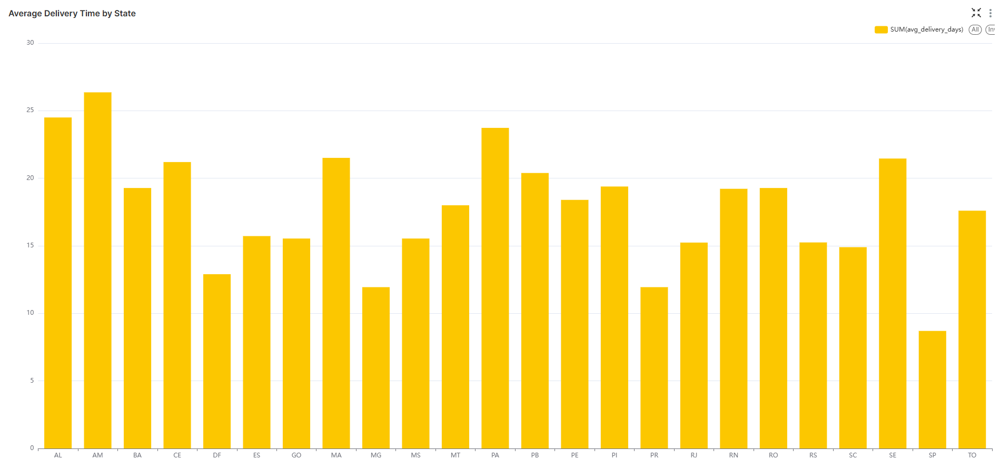
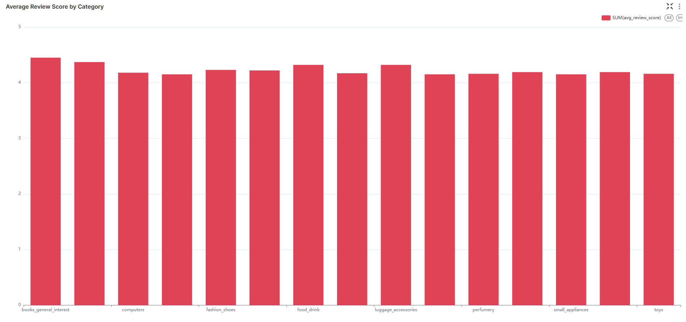

# 🛒 Olist Big Data Analytics Pipeline

Bu proje, **Olist Brazilian E-Commerce** veri seti kullanılarak geliştirilmiş uçtan uca bir **Big Data Analytics Pipeline** çalışmasıdır.

Proje kapsamında ham CSV dosyaları Apache Spark ile okunmuş, Parquet formatına dönüştürülmüş, HDFS üzerinde saklanmış, Spark SQL tabloları ve star schema view'ları oluşturulmuş ve Apache Superset üzerinden görselleştirilmiştir.

---

## 📌 Proje Amacı

Bu projenin amacı, ham e-ticaret verilerini analiz edilebilir hale getiren bir veri pipeline mimarisi kurmaktır.

Pipeline akışı:

```text
Raw CSV Files
      ↓
Apache Spark
      ↓
Parquet Files
      ↓
HDFS
      ↓
Spark SQL Tables
      ↓
Star Schema Views
      ↓
Apache Superset Dashboard
```

Bu yapı sayesinde siparişler, ödemeler, ürün kategorileri, müşteri lokasyonları, teslimat performansı ve yorum skorları analiz edilebilir hale getirilmiştir.

---

## 📊 Dashboard Ön İzleme

Projede oluşturulan Superset dashboard'u aşağıdaki gibidir:







---

## 🧰 Kullanılan Teknolojiler

- Docker & Docker Compose
- Apache Spark
- HDFS
- Spark SQL
- Spark ThriftServer
- Apache Superset
- Python
- SQL
- Parquet
- Git & GitHub

---

## 📁 Veri Seti

Projede **Olist Brazilian E-Commerce Public Dataset** kullanılmıştır.

Kullanılan CSV dosyaları:

- `olist_customers_dataset.csv`
- `olist_geolocation_dataset.csv`
- `olist_order_items_dataset.csv`
- `olist_order_payments_dataset.csv`
- `olist_order_reviews_dataset.csv`
- `olist_orders_dataset.csv`
- `olist_products_dataset.csv`
- `olist_sellers_dataset.csv`
- `product_category_name_translation.csv`

Ham veri dosyaları şu klasöre yerleştirilmelidir:

```text
data/raw/
```

> Not: Ham CSV dosyaları büyük olduğu için GitHub repository içerisine eklenmemelidir. Bu klasör `.gitignore` ile hariç tutulmuştur.

---

## 🏗️ Mimari Katmanlar

Projede katmanlı bir veri mimarisi kullanılmıştır.

### Bronze Layer

Ham veri katmanıdır.

Bu katmanda Kaggle'dan indirilen orijinal CSV dosyaları tutulur.

```text
data/raw/
```

### Silver Layer

İşlenmiş veri katmanıdır.

Apache Spark, CSV dosyalarını okuyarak Parquet formatına dönüştürür ve HDFS üzerine yazar.

```text
hdfs://namenode:9000/olist/parquet/
```

### Gold Layer

Analitik sorgular ve dashboard için hazırlanan katmandır.

Bu katmanda Spark SQL tabloları ve star schema view'ları oluşturulur.

İlgili dosyalar:

- `processing/create_spark_tables.sql`
- `processing/create_star_schema_views.sql`

### Visualization Layer

Apache Superset kullanılarak dashboard ve grafikler oluşturulmuştur.

Dashboard adı:

```text
Olist Dashboard
```

---

## 📂 Proje Klasör Yapısı

```text
BigData-Pipeline-Project/
├── docker/
│   ├── docker-compose-dev.yml
│   ├── docker-compose-hdfs.yml
│   ├── docker-compose-minio.yml
│   ├── docker-compose-spark.yml
│   ├── docker-compose-superset.yml
│   ├── Dockerfile.dev
│   └── Dockerfile.superset
│
├── processing/
│   ├── analysis.py
│   ├── csv_to_parquet.py
│   ├── create_spark_tables.sql
│   └── create_star_schema_views.sql
│
├── reports/
│   └── REPORT.md
│
├── scripts/
│   ├── download_dataset.py
│   ├── setup_network.ps1
│   └── setup_network.sh
│
├── visualization/
│   ├── register_tables.py
│   └── screenshots/
│
├── .gitignore
└── README.md
```

---

## 🚀 Projeyi Çalıştırma

### 1. Docker Network Oluşturma

Windows PowerShell için:

```powershell
.\scripts\setup_network.ps1
```

Alternatif olarak manuel şekilde:

```powershell
docker network create bigdata-net
```

---

### 2. Servisleri Başlatma

```powershell
docker compose -f docker/docker-compose-hdfs.yml up -d
docker compose -f docker/docker-compose-spark.yml up -d
docker compose -f docker/docker-compose-superset.yml up -d
```

---

### 3. Servisleri Kontrol Etme

| Servis | URL |
|---|---|
| HDFS NameNode | http://localhost:9870 |
| Spark Master | http://localhost:8080 |
| Apache Superset | http://localhost:8088 |

Superset giriş bilgileri:

```text
username: admin
password: admin
```

---

## ⚙️ Veri İşleme Süreci

### 1. CSV Dosyalarını Parquet Formatına Dönüştürme

Aşağıdaki script, `data/raw/` klasöründeki 9 CSV dosyasını okur ve HDFS üzerine Parquet formatında yazar.

```powershell
docker exec -it spark-master /spark/bin/spark-submit --master local[*] /app/processing/csv_to_parquet.py
```

Çıktı konumu:

```text
hdfs://namenode:9000/olist/parquet/
```

Oluşturulan Parquet klasörleri:

- `/olist/parquet/customers`
- `/olist/parquet/geolocation`
- `/olist/parquet/orders`
- `/olist/parquet/order_items`
- `/olist/parquet/order_payments`
- `/olist/parquet/order_reviews`
- `/olist/parquet/products`
- `/olist/parquet/sellers`
- `/olist/parquet/category_translation`

---

### 2. Spark SQL Tablolarını Oluşturma

Parquet dosyalarından Spark SQL external tablolarını oluşturmak için:

```powershell
docker exec -it spark-thriftserver /spark/bin/beeline -u jdbc:hive2://localhost:10000/default -f /app/processing/create_spark_tables.sql
```

Oluşturulan temel tablolar:

- `customers`
- `geolocation`
- `orders`
- `order_items`
- `order_payments`
- `order_reviews`
- `products`
- `sellers`
- `category_translation`

---

### 3. Star Schema View'larını Oluşturma

Analitik sorgular için star schema mantığında fact ve dimension view'ları oluşturmak için:

```powershell
docker exec -it spark-thriftserver /spark/bin/beeline -u jdbc:hive2://localhost:10000/default -f /app/processing/create_star_schema_views.sql
```

---

## ⭐ Star Schema Veri Modeli

Projede iş zekası sorgularını kolaylaştırmak için star schema mantığı kullanılmıştır.

### Dimension Views

- `dim_customer`
- `dim_seller`
- `dim_product`
- `dim_order_status`
- `dim_payment_type`

### Fact Views

- `fact_order_items`
- `fact_payments`
- `fact_delivery`
- `fact_review_items`



---

## 📊 Superset Dashboard

Apache Superset, Spark ThriftServer'a Hive bağlantısı üzerinden bağlanmıştır.

Bağlantı URI:

```text
hive://hive@spark-thriftserver:10000/olist
```

Dashboard adı:

```text
Olist Dashboard
```

Oluşturulan grafikler:

- Revenue by Payment Type
- Orders by Status
- Monthly Orders
- Payment Method Trends
- Monthly Revenue by Top Product Categories
- Monthly Orders by Customer State
- Monthly Revenue by Customer State
- Order Status Trends
- Monthly Average Delivery Time by State
- Monthly Average Review Score by Category
- Revenue by Product Category
- Sales by Customer State
- Top Performing Sellers
- Average Delivery Time by State
- Average Review Score by Category

Dashboard ekran görüntüleri şu klasörde yer almaktadır:

```text
visualization/screenshots/
```

---

## 📈 Örnek Dashboard Görselleri

### Revenue by Payment Type



### Payment Method Trends



### Monthly Revenue by Top Product Categories



### Monthly Orders by Customer State



### Average Delivery Time by State



### Average Review Score by Category



---

## 📈 Cevaplanabilen Business Soruları

| Business Question | Kullanılan Fact View | Kullanılan Dimension |
|---|---|---|
| Monthly revenue | `fact_payments` | Date / `order_purchase_timestamp` |
| Revenue by product category | `fact_order_items` | `dim_product` |
| Top-performing sellers | `fact_order_items` | `dim_seller` |
| Sales by customer state | `fact_payments` | `dim_customer` |
| Average delivery time by state | `fact_delivery` | `dim_customer` |
| Payment method trends | `fact_payments` | `dim_payment_type` |
| Average review score by category | `fact_review_items` | `dim_product` |

---

## 🧪 Veri Kalitesi Yaklaşımı

Projede veri kalitesi açısından aşağıdaki noktalar dikkate alınmıştır:

- Eksik tarih değerleri teslimat analizlerinde filtrelenmiştir.
- Ürün kategori isimleri İngilizce karşılıklarıyla eşleştirilmiştir.
- Tarih kolonları analizlerde timestamp/date formatına dönüştürülmüştür.
- Tekrarlı görünen bazı kayıtların iş mantığı gereği normal olabileceği dikkate alınmıştır.
  - Bir siparişin birden fazla ürünü olabilir.
  - Bir siparişin birden fazla ödeme satırı olabilir.
- Duplicate kontrolü tablo grain'ine göre değerlendirilmelidir.

---

## 🔁 ETL / ELT Yaklaşımı

Bu projede ağırlıklı olarak **ETL** yaklaşımı kullanılmıştır.

```text
Extract → Transform → Load
```

Bu projedeki karşılığı:

- Extract: CSV dosyaları `data/raw/` klasöründen okunur.
- Transform: Spark ile Parquet formatına dönüştürülür ve SQL tabloları hazırlanır.
- Load: İşlenmiş veri HDFS üzerine yüklenir ve Superset tarafından sorgulanır.

Modern veri platformlarında ELT yaklaşımı ve dbt gibi araçlar da sık kullanılır. Bu projede dbt kullanılmamıştır; ancak Spark SQL dosyaları ile benzer şekilde analitik modelleme yapılmıştır.

---

## 📄 Detaylı Rapor

Detaylı proje raporu:

```text
reports/REPORT.md
```

Rapor içeriği:

- Proje amacı
- Veri seti açıklaması
- Pipeline mimarisi
- Veri kalitesi
- ETL / ELT yaklaşımı
- dbt açıklaması
- Star schema tasarımı
- Fact ve dimension tablolar
- Business question mapping
- Superset dashboard açıklaması

---

## ✅ Sonuç

Bu proje kapsamında Olist e-ticaret veri seti kullanılarak çalışan bir big data analytics pipeline geliştirilmiştir.

Ham CSV verileri Spark ile işlenmiş, Parquet formatında HDFS üzerinde saklanmış, Spark SQL tabloları ve star schema view'ları oluşturulmuş ve Apache Superset üzerinde görselleştirilmiştir.

Sonuç olarak ham veri, iş kararlarını destekleyen analiz edilebilir dashboard çıktısına dönüştürülmüştür.