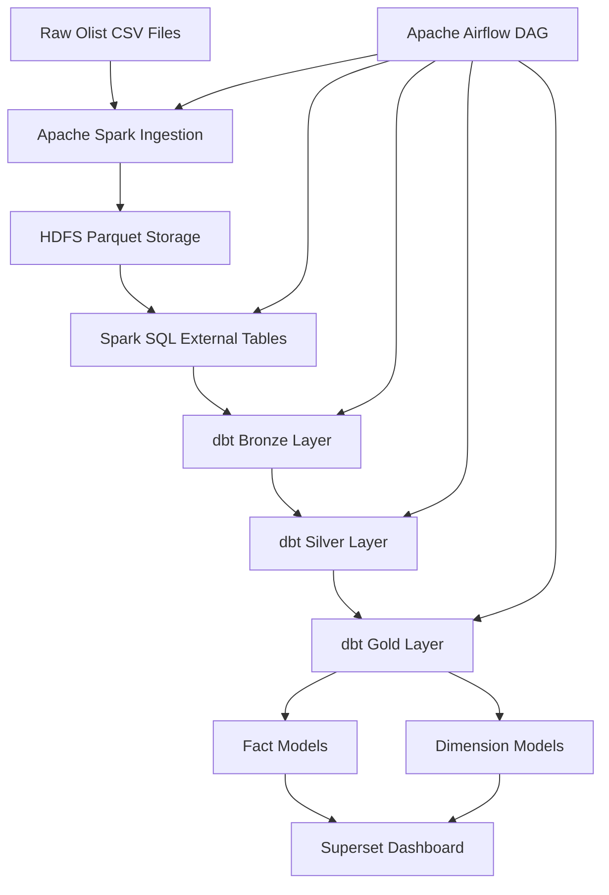

# Re-Construct Data Pipeline Report

## 1. Introduction

This report explains the reconstruction of the Olist Big Data Analytics Pipeline.

The original project processed the Olist Brazilian E-Commerce CSV files with Apache Spark, stored the outputs as Parquet files on HDFS, registered Spark SQL tables, and visualized the results in Apache Superset.

In this reconstruction phase, the pipeline was extended with two major components:

1. **Apache Airflow** was integrated as the orchestration layer.
2. **dbt** was implemented as the transformation and analytical modeling layer.

With these additions, the project was restructured into a more modular and maintainable architecture based on the **Medallion Architecture**: Bronze, Silver, and Gold layers.

The updated pipeline flow is:

```text
Raw Olist CSV Files
        ↓
Apache Spark Ingestion
        ↓
HDFS Parquet Storage
        ↓
Spark SQL External Tables
        ↓
dbt Bronze Models
        ↓
dbt Silver Models
        ↓
dbt Gold Star Schema Models
        ↓
Apache Superset Dashboard
```

---

## 2. Apache Airflow Core Components

Apache Airflow is used to define, schedule, automate, and monitor workflows as Directed Acyclic Graphs.

- **DAG**: A DAG defines the complete workflow and the dependency order between pipeline tasks.
- **Task**: A task is a single unit of work inside a DAG, such as running Spark ingestion or executing dbt models.
- **Operator**: An operator defines how a task is executed; this project uses `BashOperator` to run Docker, Spark, Beeline, and dbt commands.
- **Scheduler**: The scheduler decides when DAG runs and tasks should be executed.
- **Executor**: The executor runs the scheduled tasks; this project uses Airflow with a local execution setup.
- **Webserver**: The webserver provides the Airflow UI for monitoring DAG runs, task status, and logs.
- **Metadata Database**: The metadata database stores DAG runs, task states, users, and Airflow configuration information.

---

## 3. Airflow DAG Design

The Airflow DAG file is located at:

```text
orchestration/dags/olist_reconstructed_pipeline.py
```

The DAG name is:

```text
olist_reconstructed_pipeline
```

The DAG was designed as a linear workflow because each step depends on the successful output of the previous step. For example, dbt transformations should not run before Spark ingestion and Spark SQL table registration are completed.

The task order is:

```text
check_required_containers
        ↓
spark_ingestion_csv_to_hdfs_parquet
        ↓
register_external_spark_tables
        ↓
dbt_debug_connection
        ↓
dbt_run_medallion_models
        ↓
dbt_test_gold_models
        ↓
register_existing_star_schema_views
        ↓
superset_dashboard_ready
```

The DAG is manually triggered using Airflow because this project is developed in a local environment. In a production environment, the DAG could be scheduled daily, weekly, or based on data availability.

---

## 4. Airflow Task Boundaries, Operator Choices, and Resource Configuration

### 4.1 check_required_containers

This task checks whether the required Docker containers are running before the pipeline starts.

Required services include:

- HDFS NameNode
- Spark Master
- Spark ThriftServer
- dbt container
- Superset container

**Operator choice:** `BashOperator`

**Reason:** This task executes shell commands such as `docker ps` and `grep`, so BashOperator is simple and appropriate.

**Boundary:** This task does not transform data. It only validates the runtime environment.

---

### 4.2 spark_ingestion_csv_to_hdfs_parquet

This task runs the Spark ingestion script:

```text
processing/csv_to_parquet.py
```

The script reads the 9 Olist CSV files from:

```text
data/raw/
```

and writes them as Parquet files to:

```text
hdfs://namenode:9000/olist/parquet/
```

**Operator choice:** `BashOperator`

**Reason:** The task runs `spark-submit` inside the Spark container.

**Boundary:** This task is responsible only for ingestion and file format conversion. It does not create analytical models.

**Resource configuration:** Spark is executed with:

```text
--master local[*]
```

This uses available local cores inside the Spark container and is sufficient for the local project environment.

---

### 4.3 register_external_spark_tables

This task runs the SQL file:

```text
processing/create_spark_tables.sql
```

It registers the Parquet outputs as Spark SQL external tables.

**Operator choice:** `BashOperator`

**Reason:** The task runs Beeline against Spark ThriftServer.

**Boundary:** This task only registers HDFS Parquet folders as queryable Spark SQL tables.

---

### 4.4 dbt_debug_connection

This task runs:

```text
dbt debug
```

It validates that dbt can read the project files and connect to Spark ThriftServer.

**Operator choice:** `BashOperator`

**Reason:** dbt is executed inside the `olist-dbt` container.

**Boundary:** This task does not create models. It only validates connection and configuration.

---

### 4.5 dbt_run_medallion_models

This task runs:

```text
dbt run
```

It builds the dbt Bronze, Silver, and Gold models.

**Operator choice:** `BashOperator`

**Reason:** dbt transformations are command-line based and run inside the dbt container.

**Boundary:** This is the main transformation step. It is responsible for modular SQL transformations.

---

### 4.6 dbt_test_gold_models

This task runs:

```text
dbt test
```

It executes data quality tests defined in dbt `schema.yml`.

Tests include checks such as:

- `not_null`
- `unique`

**Operator choice:** `BashOperator`

**Reason:** dbt tests are executed using the dbt CLI.

**Boundary:** This task validates the analytical models but does not create new data outputs.

---

### 4.7 register_existing_star_schema_views

This task runs:

```text
processing/create_star_schema_views.sql
```

It refreshes the existing Spark SQL star schema views.

**Operator choice:** `BashOperator`

**Reason:** The task executes SQL through Beeline.

**Boundary:** This task keeps compatibility with the earlier Spark SQL star schema views already used by the dashboard.

---

### 4.8 superset_dashboard_ready

This task prints a final message indicating that the Superset dashboard layer is ready.

**Operator choice:** `BashOperator`

**Reason:** It is a lightweight terminal task.

**Boundary:** This task does not refresh Superset automatically; it documents the final stage of the pipeline.

---

## 5. dbt Project and Medallion Architecture

The dbt project is located under:

```text
dbt_olist/
```

The dbt models are organized into three layers:

```text
dbt_olist/models/bronze/
dbt_olist/models/silver/
dbt_olist/models/gold/
```

This structure follows the Medallion Architecture.

---

## 6. Bronze Layer

The Bronze layer represents raw source tables registered in Spark SQL.

Bronze models are close to the original source structure. They do not apply heavy transformations.

Examples:

- `bronze_customers`
- `bronze_orders`
- `bronze_order_items`
- `bronze_order_payments`
- `bronze_order_reviews`
- `bronze_products`
- `bronze_sellers`

The purpose of the Bronze layer is to create a stable raw input boundary for dbt. This makes the rest of the transformations independent from the original table definitions.

---

## 7. Silver Layer

The Silver layer cleans and standardizes the data.

Main operations in the Silver layer include:

- casting numeric columns to correct data types,
- casting date fields to timestamp types,
- filtering records with missing primary keys,
- standardizing city names with lowercase formatting,
- standardizing state codes with uppercase formatting,
- preparing product category translations,
- aggregating geolocation records by zip code prefix.

Examples:

- `silver_customers`
- `silver_orders`
- `silver_order_items`
- `silver_order_payments`
- `silver_products`
- `silver_geolocation`

This layer improves data quality and creates a clean boundary between raw data and business-ready models.

---

## 8. Gold Layer and Star Schema

The Gold layer contains analytical models used for reporting and dashboarding.

Dimension models:

- `dim_customer`
- `dim_seller`
- `dim_product`
- `dim_order_status`
- `dim_payment_type`
- `dim_geolocation`

Fact models:

- `fact_order_items`
- `fact_payments`
- `fact_delivery`
- `fact_review_items`

The Gold layer follows star schema logic. Fact models contain measurable business events, while dimension models contain descriptive attributes.

For example:

- `fact_payments` supports revenue and payment method analysis.
- `fact_order_items` supports product category revenue and seller performance analysis.
- `fact_delivery` supports delivery time analysis.
- `fact_review_items` supports review score analysis.

---

## 9. Medallion Architecture Diagram



---

## 10. Business Question Mapping

| Business Question | Model Used |
|---|---|
| Monthly revenue | `fact_payments` |
| Revenue by product category | `fact_order_items` + `dim_product` |
| Top-performing sellers | `fact_order_items` + `dim_seller` |
| Sales by customer state | `fact_payments` + `dim_customer` |
| Average delivery time by state | `fact_delivery` + `dim_customer` |
| Payment method trends | `fact_payments` + `dim_payment_type` |
| Average review score by category | `fact_review_items` + `dim_product` |

This mapping shows how the Gold layer supports business-oriented dashboard analysis.

---

## 11. Benefits of the Reconstructed Architecture

The reconstructed architecture provides several benefits.

First, Airflow makes the pipeline reproducible and monitorable. Instead of running Spark and dbt commands manually, the full workflow can be executed from a single DAG.

Second, dbt modularizes the transformation logic. Bronze, Silver, and Gold layers separate raw data access, cleaning logic, and business-facing analytics.

Third, data quality improves through dbt tests. Important identifiers and analytical fields are checked with `not_null` and `unique` tests.

Fourth, the star schema structure makes dashboard queries easier and more consistent. Superset can use fact and dimension models instead of complex raw joins.

Finally, the architecture is easier to extend. New business questions can be answered by adding new dbt models or extending the Gold layer.

---

## 12. Challenging Parts of the Reconstruction

The first challenge was connecting multiple containers. Airflow, dbt, Spark, HDFS, and Superset needed to communicate through the same Docker network.

The second challenge was integrating dbt with Spark. dbt connects to Spark through Spark ThriftServer, so the Spark SQL external tables had to be created before dbt models could run.

The third challenge was defining clean data boundaries. Bronze, Silver, and Gold layers needed clear responsibilities to avoid mixing raw data, cleaned data, and business-ready data.

The fourth challenge was preserving compatibility with the existing dashboard. The previous Spark SQL star schema views were kept and refreshed so that the Superset dashboard could continue working.

The fifth challenge was designing the correct grain for fact models. For example, repeated `order_id` values in `order_items` are valid because one order can contain multiple products. Therefore, duplicate handling must be based on business meaning, not only on repeated IDs.

---

## 13. Conclusion

The Olist Big Data Analytics Pipeline was successfully reconstructed with Apache Airflow and dbt.

Airflow now orchestrates Spark ingestion, Spark SQL table registration, dbt transformations, dbt tests, and dashboard readiness. dbt organizes the transformation layer into Bronze, Silver, and Gold models. The Gold layer provides star schema models that support business intelligence use cases in Superset.

This reconstruction makes the pipeline more automated, modular, maintainable, and suitable for analytical reporting.
